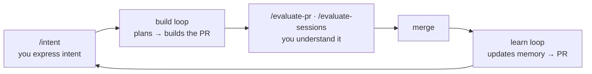
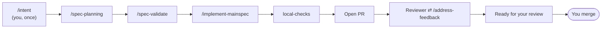

# Context Specs

**Harness engineering in practice.**

Harness engineering is building a system — defined inputs, defined outputs —
out of deterministic code and probabilistic code, where the deterministic code
invokes the probabilistic code and controls the flow all the way to a
guaranteed, well-defined output.
*([What is Harness Engineering?](https://www.linkedin.com/pulse/what-harness-engineering-rico-romero-vb7fc/))*

Context Specs is that system for building software. The **input** is a PRD with
a runnable definition of done. The **output** is a pull request that is either
**ready to merge** or **STUCK with a diagnosis** — never "maybe." In between: a
deterministic dispatcher that plans, validates, implements, verifies, and
answers the reviewer by driving fresh coding-agent processes, one bounded step
at a time. What's left for you is the judgment a model can't supply —
understanding the problem, deciding what's worth building, and telling whether
what came back is right.

The output is also your feedback signal. Every STUCK and every review finding
points at a piece of *context* to improve — the project's long-term memory, its
contract, its lints. Improve those and the ready-to-merge ratio climbs: the
system gets better at building your project every time it builds.

> **New here? Read [the full story](./docs/README.md)** — six short chapters
> that take you from the idea to the mindset shift, in order.

---

## Quickstart

```bash
# 1 · Create your harness (one repo that drives all your projects)
npx context-specs init my-harness
cd my-harness

# 2 · Register a project as an environment
context-specs add ~/code/myapp

# 3 · The Software 3.0 half: generate the project-specific pieces
cd ~/code/myapp && claude
> /env-init          # AGENTS.md, /intent, the Expert, checks, bootstrap — one PR

# 4 · After that PR merges: walk away
context-specs start
```

From then on you live in a three-beat cycle — **express intent, the harness
builds, you evaluate**:



`context-specs status` shows every environment's features and phases;
`run <env>` does one foreground pass; `logs <env> -f` follows the loop;
`doctor` checks the wiring.

---

## The architecture: one harness, N environments

```
HARNESS REPO (tier 1 — yours, one)      ENVIRONMENT REPOS (tier 2 — your projects)
  bin/context-specs   the CLI             AGENTS.md               the eager contract
  scripts/            the dispatchers     .claude/skills/intent/  project-owned /intent
  skills/             canonical skills    .claude/skills/expert/  long-term memory
  state/<env>/        runtime state       scripts/                bootstrap + local checks
                                          .harness/env            this env's dials
```

The dividing line is one test: **could you write it without reading the
project's code?** Yes → harness repo; improve it once and every environment
benefits. No → it's *Software 3.0* — generated by an agent reading that
project, committed to that project, evolving with it. `context-specs add`
connects the tiers by symlinking the canonical skills into each environment
(gitignored); `/env-init` generates the project-owned half.

Two artifacts are deliberately project-owned rather than shared, because they
are the two **developer-owned levers**:

- **`/intent`** — the input side. How well a project turns an idea into a PRD +
  runnable definition of done is one of the biggest levers it has; tune the
  skill to your project.
- **The Expert** — the memory side. The project's long-term memory, which
  informs every future plan. The loops file things into it; you shape it.

## The system, end to end

> Describe a feature to `/intent` and confirm it. Walk away. The project plans
> the feature, validates the plan, implements it, runs its checks, opens a pull
> request, answers the reviewer — and hands you back a PR that's ready to merge,
> or an honest STUCK with the diagnosis started.



You can trust a machine to run this unattended because it keeps **no hidden
state**: every feature's state is observable from files on disk and branches in
git. A small deterministic dispatcher — **no LLM in the decision path** — reads
that state each tick and shells out to a fresh `claude -p` process per step, so
no step inherits another's polluted window and crash recovery is free. It never
touches your checkout: it works your repo's *refs* and its own sibling
worktrees. Four layers of verification (pre-commit, slice tests,
`local-checks`, and a runnable `run-prd-test.sh` definition of done) can't be
talked past — and the loop is **goal-based**: the runner *is* the goal, and the
dispatcher keeps invoking the agent until it exits 0 or a bounded retry cap
turns honest failure into STUCK.

The scheduling is one exit code: a tick that advanced work re-fires
immediately (work drains at machine speed), an idle tick naps the interval, a
stuck feature never hot-loops. That's the whole deterministic half —
[read the invariants](./docs/invariants.md) for the proof it's safe to leave
running.

→ [Chapter 3 — The agent harness](./docs/3-the-agent-harness.md)

## Memory: long-term informs short-term

**SDD is the harness's short-term memory.** `/spec-planning` writes the plan for
one feature — a mainspec plus temporally-ordered slices — to disk, *outside* the
context window, so it can't decay or compact away; the implementer is fed one
slice at a time, the right context at the right time, no human routing needed.

**The Expert is the long-term memory** — and short-term memory is written *from*
it: every plan is informed by what the project already knows. Improve one shard
of long-term memory and every future feature plans better. It's written back on
two rhythms:

- **Reflection** — in the hot path. After each slice goes green, the implementer
  judges whether what it learned should change the project's memory. High bar;
  most slices change nothing.
- **`/learn`** — off the hot path. After each merge, the memory loop reads the
  merged diff and routes what's worth keeping into the Expert, `AGENTS.md`, or a
  custom lint the agent can't ship past — then raises its own `learn/<sha>` PR.
  The project consolidating what it learned while nothing is running — the way
  agentic systems "dream."

One write path per rhythm, ground truth only, always behind a human merge — and
the third write path is **you**. The Expert is developer-owned; the loops are
helpers.

→ [Chapter 2 — Spec-Driven Development](./docs/2-spec-driven-development.md) ·
[Chapter 4 — Continuous improvement](./docs/4-continuous-improvement.md)

## The human loop

*Once the machine does the typing, what's left is the part only you can do.*

The governing line is Karpathy's: *you can outsource your thinking, but you
can't outsource your understanding.* The harness took the verifiable work. The
human loop is you, working the unverifiable: whether this is the right thing to
build, whether the abstraction is sound, whether it feels right.

```
Understanding ──▶ Intent ──▶ [ the harness builds ] ──▶ Evaluate
   /wiki-init      /intent                              /evaluate-pr
                                                        /evaluate-sessions
```

- **Understanding** (`/wiki-init`) — a Karpathy "LLM Wiki" that builds *your*
  model of the problem space, so you arrive at Intent with sharper questions.
- **Intent** (`/intent`) — turn that understanding into a PRD plus a runnable
  definition of done: the system's input, and its goal.
- **Evaluate** (`/evaluate-pr` + `/evaluate-sessions`) — walk the change to
  build real understanding, *and* read the build trail to find where the
  project's context served the agents or failed them. The flywheel: *observe a
  trace → capture it as an eval → fix the context → it persists.*

Your loop's output is the harness's input; the harness's output is your loop's
input. When you evaluate, you don't just approve work — you improve the thing
that produced it.

→ [Chapter 5 — The human loop](./docs/5-the-human-loop.md)

## The shift

Put it together and your project stops being a codebase you type into and
becomes a **harness you tune**. The code is an output of the system; your
attention moves from syntax to context. Three things stay yours: deep
understanding of the problem space, theorizing and expressing intent, and
evaluating outcomes to improve the context so every future feature benefits.

A codebase you type into is a constant cost. A harness you tune is an
appreciating asset — each feature leaves it a little more capable of building
the next one.

→ [Chapter 6 — The mindset shift](./docs/6-the-mindset-shift.md)

---

## The pieces

| Where | Piece | Does |
|---|---|---|
| **CLI** | `init` / `add` / `link` | Create the harness repo; register environments; symlink skills |
| | `start` / `stop` / `run` | Supervise the loops (drain-on-advance) / one foreground pass |
| | `status` / `logs` / `doctor` | Observe every environment; check the wiring |
| **Dispatchers** | `scripts/poll-and-dispatch.sh` | The build loop: PRD → PR, one deterministic step per tick |
| | `scripts/learn-dispatch.sh` | The memory loop: merged diff → `learn/<sha>` PR |
| **SDD skills** | `/spec-planning` | PRD → mainspec + temporal slices (short-term memory) |
| | `/spec-validate` | Multi-agent consensus review of the plan |
| | `/implement-mainspec`, `/implement-slice` | Implement slices in order, unit tests + Reflect |
| **Harness skills** | `/env-init` | Guided setup of a project as an environment |
| | `/fix-local-checks` | Honest fixes for a failing pre-PR gate |
| | `/address-feedback` | Triage and answer reviewer findings |
| | `/learn` | Post-merge long-term memory update |
| **Human loop** | `/wiki-init` | Stand up a Karpathy LLM-wiki (Understanding) |
| | `/intent` | Idea → PRD + runnable definition of done (project-owned) |
| | `/evaluate-pr` | Evaluate the change; build understanding |
| | `/evaluate-sessions` | Evaluate the build trail; capture evals |

*(Only want the spec workflow? It stands alone — symlink or copy the SDD skills
and drive `/spec-planning` → `/spec-validate` → `/implement-mainspec` by hand.
No harness needed.)*

## Documentation

- **[The full story](./docs/README.md)** — the six chapters, read in order.
- **[Design invariants](./docs/invariants.md)** — the properties that make the
  harness safe to leave running.

## License

Apache 2.0
