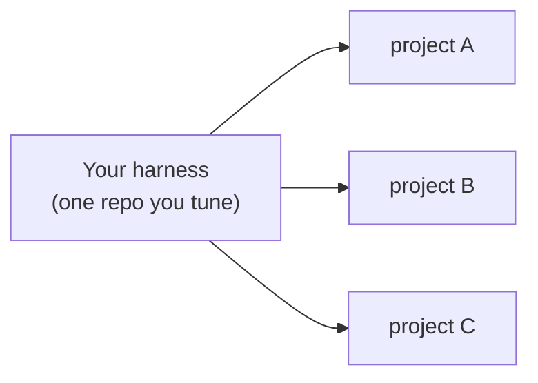
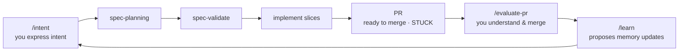

# Context Specs

**Applied harness engineering.**

*Harness engineering is building a system — defined inputs, defined outputs — out of
deterministic code and probabilistic code, where the deterministic code invokes the
probabilistic code and controls the flow all the way to a guaranteed, well-defined
output.*

Context Specs is that system for coding — **autonomous** and **goal-based**. You
express intent (your goal); the harness plans the feature with **Spec-Driven
Development** and implements it slice by slice, on its own; you always get back a
pull request (your guaranteed output) — either **ready to merge**, or **STUCK with a
diagnosis** of what blocked it.

## The point isn't one PR — it's the system that produces them

You work at the level of the **system that builds features**, not the individual
feature. That distinction is the whole idea:

- **Fix a piece of code** and you ship that one feature. Nothing else changes; the
  next feature starts where the last one did.
- **Fix a context gap** — a thin definition of done, a missing piece of long-term
  memory, an environment the agent couldn't navigate — and *every future feature*
  gets better. You fixed a class of failure, not an instance.

You do both, but context-gap fixes are the main lever, because they compound. As you
pull it, more PRs come back ready-to-merge and fewer come back stuck.

So the craft shifts. Instead of typing features, you do **context engineering**: set
up environments agents can work in, pin goals to a real definition of done, and grow
the project's long-term memory — the accumulated knowledge that tells the agent how
to plan every feature. Getting that right is what turns AI slop into PRs you can
actually merge. You operate on the harness; the harness operates on the code.

## One harness, many projects

You maintain **one** harness repo and point it at any number of project repos. Improve
the harness once and every project inherits it.



How the two tiers divide, how the deterministic dispatcher drives each project, and
why it's safe to leave running are all in the docs — this README stays deliberately
short.

## Quickstart

```bash
# 1 · Create your harness (one repo that drives all your projects — and it's yours)
npm i -g context-specs
context-specs init my-harness
cd my-harness

# 2 · Register a project as an environment
context-specs add ~/code/myapp

# 3 · Generate the project-specific pieces, then merge the PR it opens
cd ~/code/myapp && claude
> /env-init          # AGENTS.md, /intent, the Expert, checks, bootstrap

# 4 · Describe a feature, then walk away
> /intent            # idea → PRD + runnable definition of done
# then, back in your harness repo:
context-specs start
```

From there you live in a three-beat cycle — **express intent, the harness builds, you
evaluate**. The middle beat is SDD, run end to end without you:



`context-specs status` shows every project's features and phases; `run` does one
foreground pass; `logs <env> -f` follows the loop; `doctor` checks the wiring.

## Your harness, upgraded without losing your edits

`init` **vendors** the skills, subagents and dispatchers into your own git repo —
no fork, no `upstream` remote. Editing them is the point: that is how the harness
gets better at *your* projects.

So upgrades have to merge, not overwrite:

```bash
npm i -g context-specs@latest
context-specs update      # 3-way merges the release against your edits
> /update-harness         # resolves what a merge tool can't judge
```

Most files resolve mechanically. What is left over — genuine conflicts, and prose
that merged cleanly but may no longer *mean* one thing — goes to a skill that
reconstructs why your edit exists from your own git history and recommends a call.
See [Update a harness](./docs/how-to/update-a-harness.md).

## Specs are short-term memory

Most SDD tooling stops at the spec: a human drives the spec, then a human drives the
implementation. Here the spec is the harness's **short-term memory** — and the harness
runs it all the way to a PR.

A spec is true *right now*, about *this* feature. `specs/<feature>/mainspec.md` is the
end state you work backward from; ordered slices under `specs/<feature>/slices/` are
the path to it, each naming the real files it touches. The agent is fed one slice at a
time, so its window stays small and the plan can't decay or compact away — after a
compaction it just re-reads the spec. Once the feature ships, the spec stops steering
anything and survives only as a record.

Durable knowledge lives elsewhere, in **long-term memory**: the Expert, `AGENTS.md`,
and lints. The bridge between them is **Reflect** — at the end of each slice, once the
code is green, the agent writes back only what is genuinely durable. The bar is high;
most slices reflect nothing. Keeping the two separate is what lets each do its job:
specs stay lean and disposable, long-term memory stays curated and permanent.

That pairing is the flywheel. [`/learn`](./docs/concepts/long-term-memory.md) runs
after a feature merges and opens its *own* PR against your memory — you review that
too — so the next feature is planned by a harness that knows more than it did.

## Documentation

- **[How Context Specs works](./docs/overview.md)** — the narrative tour, start to
  finish.
- **[Spec-Driven Development](./docs/concepts/spec-driven-development.md)** — how the
  harness builds one feature: mainspec, slices, validation, Reflect.
- **[Core concepts](./docs/README.md#core-concepts)** — harness engineering, context
  engineering, the dispatcher, memory, continuous improvement, the human loop.
- **[How-to guides](./docs/README.md#how-to-guides)** — set up, run, and improve the
  harness.
- **[Design invariants](./docs/reference/invariants.md)** — the proof it's safe to
  leave running.

## License

Apache 2.0
