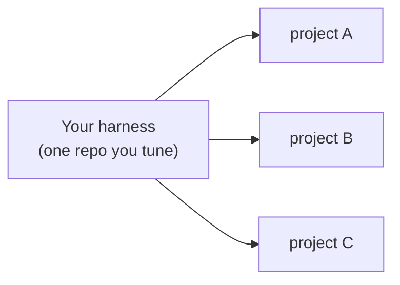
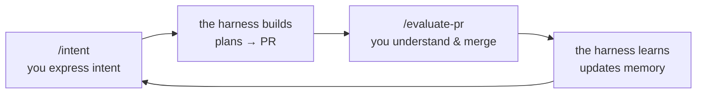

# Context Specs

**Applied harness engineering.**

*Harness engineering is building a system — defined inputs, defined outputs — out of
deterministic code and probabilistic code, where the deterministic code invokes the
probabilistic code and controls the flow all the way to a guaranteed, well-defined
output.*

Context Specs is that system for coding — **autonomous** and **goal-based**. You
express intent (your goal); the harness runs on its own; you always get back a pull
request (your guaranteed output) — either **ready to merge**, or **STUCK with a
diagnosis** of what blocked it.

## The point isn't one PR — it's the system that produces them

You work at the level of the **system that builds features**, not the individual
feature. That distinction is the whole idea:

- **Fix a piece of code** and you ship that one feature. Nothing else changes; the
  next feature starts where the last one did.
- **Fix a context gap** — a thin definition of done, a missing piece of long-term
  memory, an environment the agent couldn't navigate — and *every future feature*
  gets better. You fixed a class of failure, not an instance.

You do both, but context-gap fixes are the main lever, because they compound. As you
pull it, more PRs come back ready-to-merge and fewer come back stuck.

So the craft shifts. Instead of typing features, you do **context engineering**: set
up environments agents can work in, pin goals to a real definition of done, and grow
the project's long-term memory — the accumulated knowledge that tells the agent how
to plan every feature. Getting that right is what turns AI slop into PRs you can
actually merge. You operate on the harness; the harness operates on the code.

## One harness, many projects

You maintain **one** harness repo and point it at any number of project repos. Improve
the harness once and every project inherits it.



How the two tiers divide, how the deterministic dispatcher drives each project, and
why it's safe to leave running are all in the docs — this README stays deliberately
short.

## Quickstart

```bash
# 1 · Create your harness (one repo that drives all your projects)
npx context-specs init my-harness
cd my-harness

# 2 · Register a project as an environment
context-specs add ~/code/myapp

# 3 · Generate the project-specific pieces, then merge the PR it opens
cd ~/code/myapp && claude
> /env-init          # AGENTS.md, /intent, the Expert, checks, bootstrap

# 4 · Describe a feature, then walk away
> /intent            # idea → PRD + runnable definition of done
# then, back in your harness repo:
context-specs start
```

From there you live in a three-beat cycle — **express intent, the harness builds, you
evaluate**:



`context-specs status` shows every project's features and phases; `run` does one
foreground pass; `logs <env> -f` follows the loop; `doctor` checks the wiring.

## Documentation

- **[How Context Specs works](./docs/overview.md)** — the narrative tour, start to
  finish.
- **[Core concepts](./docs/README.md#core-concepts)** — harness engineering, context
  engineering, the dispatcher, memory, continuous improvement, the human loop.
- **[How-to guides](./docs/README.md#how-to-guides)** — set up, run, and improve the
  harness.
- **[Design invariants](./docs/reference/invariants.md)** — the proof it's safe to
  leave running.

## License

Apache 2.0
