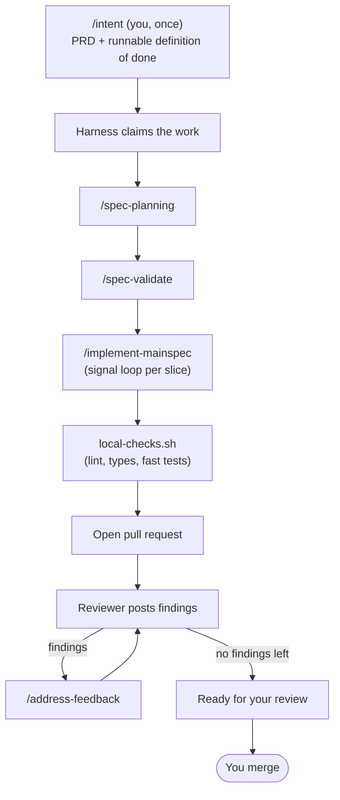

# Chapter 3 — The agent harness

*The system: deterministic code driving probabilistic code to a guaranteed output.*

Here is the whole promise of this chapter in one sequence:

> You describe a feature to your project's `/intent` and confirm it. Then you
> walk away. The project plans the feature, validates the plan, implements it,
> runs its checks, opens a pull request, answers the reviewer's comments — and
> hands you back a PR that's ready to merge. You come back to finished work you
> never typed.

That's the harness. It takes the Chapter 2 loop — `/spec-planning` →
`/spec-validate` → `/implement-mainspec` — that you used to drive by hand, and
**runs it autonomously**, end to end, while you do something else.

Name what this is, because the name is the design: **harness engineering** —
building a system with defined inputs and defined outputs out of deterministic
code and probabilistic code, where the deterministic code invokes the
probabilistic code and controls the flow to a guaranteed, well-defined output.
The input is a PRD with a runnable definition of done. The output is **a PR
that is either ready to merge or STUCK with a diagnosis** — the system never
hands back "maybe." Everything in this chapter is in service of that contract,
and of the question it raises: *why would you trust a machine to do this
unattended?*

## Two tiers: one harness, N environments

The harness is not something you install into a project. It's its own repo —
**the harness repo** — that operates on any number of project repos, called
**environments**:

```
HARNESS REPO (yours, one)               ENVIRONMENT REPOS (your projects, many)
  bin/context-specs   the CLI             AGENTS.md                the eager contract
  scripts/            the dispatchers     .claude/skills/intent/   project-owned /intent
  skills/             canonical skills    .claude/skills/expert/   long-term memory
  state/<env>/        runtime state       scripts/bootstrap-worktree.sh, local-checks.sh
                                          .harness/env             this env's dials
```

The dividing line is a single test: *could you write it without reading the
project's code?* Yes → it lives in the harness repo, where improving it once
improves every environment. No → it's **Software 3.0**, generated by an LLM
reading that project, committed to that project, evolving with it.

The two tiers meet through symlinks: `context-specs add <path>` links the
canonical skills into an environment's `.claude/skills/` (gitignored — they're
the harness's, not the project's). Two skills are deliberately *not* linked,
because they are the project's two owned levers: **/intent** (installed as a
committed copy — how well a project expresses intent is one of the biggest
levers it has) and **the Expert** (the long-term memory, Chapter 4). The setup
itself demonstrates the discipline: the CLI does the deterministic half, then
the `/env-init` skill reads the project and generates the Software 3.0 half.

## The autonomous loop

A feature flows through the harness as a sequence of states. Each state is
advanced by a skill; the next skill fires when the previous one's output appears
on disk:



The only human touch in that diagram is the first box and the last. In between,
the project builds the feature itself. The reviewer/responder exchange is bounded
so it can't argue forever, and if any step genuinely can't make progress, the
harness stops and hands you the problem rather than faking success — more on both
below.

### `/intent` — the goal, pinned down

The loop begins with the single human-attentive skill in the chain. `/intent`
turns an open-ended idea into two coupled artifacts:

- `prds/<feature>/prd.md` — the prose: **why** this exists and **what** "done"
  means;
- `prds/<feature>/run-prd-test.sh` — the executable: **how you'll know** it's
  done. It exits 0 when the feature is built.

The runner is the load-bearing idea, and it's what makes the harness
**goal-based**: the runner *is* the goal, and the loop keeps invoking the model
until the goal is met or the retry caps call it honestly unreachable. Prose
drifts and "done" becomes an argument; an exit code doesn't. Before `/intent`
commits anything, it runs the script against today's unbuilt code and confirms
it fails **for the right reason** — because the behavior is genuinely absent,
not because of a typo or a missing dependency. That's the empirical proof that
the test actually corresponds to the intent.

Once confirmed, the PRD lands on a branch and the harness takes over.

## Why you can trust it: artifacts are the state

The reason it's safe to leave this running is almost boring, and that's the
point. **The harness keeps no hidden state.** There is no daemon holding "I'm
currently on step 3" in memory, no queue, no coordination service. The complete
state of every feature is observable from two things: the files on disk and the
branches in git.

A small bash script — the **dispatcher**
([`scripts/poll-and-dispatch.sh`](../scripts/poll-and-dispatch.sh)) — wakes up
periodically, takes an environment as its argument, reads that environment's
state fresh, and decides the single next step for each active feature. Its core
is an `if/elif` chain: *planning output absent? run planning. Present but
validation absent? run validate.* The chain **is** the state machine; the
artifacts on disk **are** the state.

Three consequences fall out of that design, and together they're why the machine
is trustworthy:

- **Crash recovery is free.** Kill the dispatcher mid-step — `kill -9`, a dead
  laptop, a closed lid. The next tick re-reads disk, sees the half-finished
  state, and resumes. Nothing to clean up, because nothing was ever held in
  memory to lose.
- **Every step runs in a fresh context window.** The dispatcher doesn't *do* the
  work; it shells out to a brand-new `claude -p` process per skill. Each skill
  reads what it needs from disk, does its job, writes its output, and exits. No
  step inherits another's polluted window — the Chapter 1 problem, solved by
  construction. (This is also why the loop can run for hours without the context
  rot a single long session would accumulate.)
- **The dispatcher itself contains no LLM.** The decision of *what runs next* is
  pure, deterministic bash. The intelligence is in the skills; the routing is
  mechanical. That's what makes "what will it do next?" answerable just by
  looking at disk — no model in the loop to second-guess.

And one consequence for your working tree, because it's the one developers ask
about first: **the harness never touches your checkout.** It operates on your
clone only through git *refs* — fetching, pushing, claiming branches — and does
all its work in *sibling worktrees* (`<env>-harness-<feature>`) it creates and
tears down itself. Your uncommitted work is structurally out of its reach.

These properties have names and precise statements. When you want the rigorous
version — what holds under concurrency, what each layer guarantees, how recovery
composes — read the **[design invariants](./invariants.md)**. This chapter gives
you the intuition; that document gives you the proof.

## Verification the agent cannot talk past

Autonomy is only safe if "done" can't be faked. So the harness leans on checks
that run **regardless of what the agent decides**, fastest to slowest:

1. **Pre-commit hooks** — linters, formatters, type checks on changed files.
2. **Slice unit tests** — each slice's tests, run during implementation.
3. **`local-checks.sh`** — the cheapest gate before a PR: lint, typecheck, the
   fast unit suite, skip-detection, and any custom project lints. It proves
   **correctness, not coverage** — it blocks on real defects and merely warns on
   style.
4. **The PRD runner** — `./prds/<feature>/run-prd-test.sh` must exit 0. This is
   the definition of done, and because it can mix deterministic shell checks with
   an LLM-as-judge, "runnable" doesn't force everything into unit-test shape.

The agent doesn't get to decide whether these run — they run, and the git/CI
layer enforces them independently. Crucially, **silencing a check counts as
bypassing it**: an agent may never add a suppression directive, weaken a config,
or skip a test to get to green. A check it can't pass honestly is one it lets
fail.

## When it can't make progress: STUCK

Sometimes a feature genuinely can't get through a step — a plan is subtly wrong,
a check won't pass honestly. The harness doesn't loop forever, and it won't fake
success.
Every step has a bounded retry budget; when a step hits its cap, the dispatcher
declares the feature **STUCK**, posts a diagnostic to the PR, and halts that
feature until you step in.

What it hands you is deliberate. Not just "it failed" — a session log of every
`claude -p` invocation across the chain (so you can open any trace and see what
the agent saw), a tail of the failing output, and a **diagnosis-first
checklist**. The checklist's first item isn't "fix the code." It's *identify
which piece of context misled the agent* — a stale Expert note, a thin spec, a
PRD that left something out — and correct that first. Because if the context that
caused the failure stays wrong, the same class of failure comes back the next
time a feature touches that area.

STUCK is the other half of the output contract. Ready-to-merge and STUCK are
both *finished* states — the system completed its run and told you the truth
about which one you got. And the ratio between them is your metric: every STUCK
names the context to improve, and Chapter 4 is about how those improvements
compound.

## The branch namespace is the work queue

There's no separate database of "what work exists." The branches *are* the
registry:

```
prd/<author>/<feature>   ← /intent output. The waiting queue. An atomic rename
                            to feature/<f> is how the harness claims it.
feature/<feature>        ← active implementation lane.
main                     ← humans merge here. Never pushed to directly.
learn/<sha>              ← auto-generated memory update (Chapter 4).
```

Claiming a feature is a single atomic git operation — renaming `prd/<author>/<f>`
to `feature/<f>`. If two harnesses ever race for the same work, whichever pushes
the rename first wins and the other simply moves on. No lock service, no
coordination daemon; git refs are the lock. By default each developer's harness
watches only their own `prd/<my-slug>/*` queue, so your harness is your personal
assistant, not a shared teammate.

## Running it: the CLI

The deterministic half of the system extends one layer up — a small CLI in the
harness repo schedules the dispatcher:

```bash
npx context-specs init my-harness    # create your harness repo (once)
context-specs add ~/code/myapp       # register an environment, link the skills
# in ~/code/myapp:  claude → /env-init   (the Software 3.0 half, then merge its PR)
context-specs start                  # walk away
```

`start` runs one background supervisor per environment — a build loop and a
memory loop (Chapter 4). The scheduling protocol is nothing more than the
dispatcher's exit code: **0** means idle (sleep the interval, default 5
minutes), **10** means "work advanced" (re-invoke immediately). That second case
matters: a claimed PRD marches through planning → validate → implement at
machine speed, while idle polling stays cheap. Errors back off exponentially. A
STUCK feature reports idle — a stuck environment never hot-loops.

Because each environment gets its own supervisor, own lock, and own state,
**working on multiple projects at once is the default**, not a mode.
`context-specs status` shows every environment's features and phases in one
table; `context-specs run <env>` does a single foreground pass when you'd rather
watch; `logs -f` follows the loop; `doctor` checks the wiring.

The trigger is still the portable part: the same dispatcher that a laptop
supervisor invokes can be invoked by cron or a server runner. When a team
outgrows local laptops, they move the *scheduler* and keep everything else.
It's an upgrade path, not a rewrite.

---

So the harness builds features on its own, and refuses to fake the ones it can't.
That alone would be worth having. But there's a second thing it does, and it's
the one that makes the project genuinely *yours* over time.

Every feature that merges teaches the project something — a new pattern, a
constraint nobody had written down, a rule worth enforcing forever. A harness
that only *built* features would relearn those lessons every time. This one
doesn't. It remembers.

→ [Chapter 4 — Continuous improvement](./4-continuous-improvement.md)
