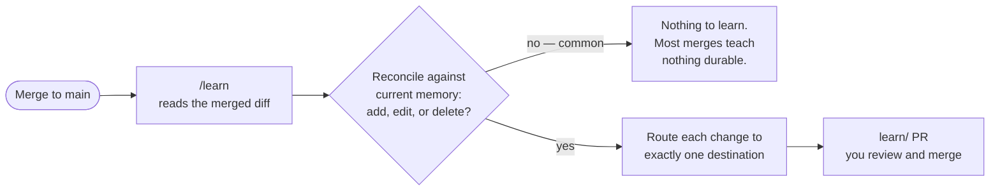

# Long-term memory

Long-term memory is what makes the harness get *better* at building your project,
not just fast at it. Where a [spec](./spec-driven-development.md) is short-term
memory for one feature, long-term memory is durable, cross-feature knowledge:
architecture, patterns, constraints, and the rules the project has learned to
enforce. Improve one shard of it and every future feature plans better.

## Two memory shapes, opposite costs

The harness keeps long-term memory in two places, and the difference between them
is the whole discipline — not an implementation detail:

- **The Expert** is **lazy memory** — pulled on demand. It enters a context window
  only when a skill deliberately consults it, so you pay tokens for it *only when
  it earns them*. This is the default home for real knowledge: architecture,
  patterns, how things get verified here.
- **`AGENTS.md`** is **eager memory** — loaded automatically into every agent that
  touches the folder, before anyone knows whether it is relevant. You pay for every
  line on *every* session, so the bar for putting something here is much higher.

Because eager memory is a standing tax and lazy memory is paid only when consulted,
the two compose as **map and territory**: `AGENTS.md` is a short table of contents
that *points into* the Expert; it never duplicates the dense knowledge. A
monolithic `AGENTS.md` rots, crowds out the task, and turns "everything important"
into "nothing important." Keep it a map; keep the density in the Expert. Using
`AGENTS.md` — the vendor-neutral file every harness reads — rather than a
tool-specific one also keeps your project's memory *yours*, portable across
whatever agent you point at it.

## The Expert: knowledge defined once, pulled on demand

An **Expert** is a progressively-disclosed knowledge module:

```
expert/                # (or expert-{name}/ for an outside domain)
├── SKILL.md           # high-level index + routing table, read first
└── references/        # dense knowledge, one topic per file, read on demand
    └── {prefix}-{topic}.md
```

It is the [context-engineering](./context-engineering.md) menu made concrete: a
short `SKILL.md` the agent sees first, pointing into dense `references/` it loads
only when relevant. Define the knowledge once and it flows automatically through
every phase — you never paste it into a prompt again. Experts are **composable**:
a React Expert and a DynamoDB Expert both contribute to a full-stack feature, and
organizations can layer in private Experts for internal libraries without touching
any existing skill.

The Expert is one of the two [developer-owned levers](./two-tier-architecture.md).
It is seeded as a skeleton by `/env-init` and grows from there.

## What memory holds, and how it's written

The memory is **the developer's**. Anything that helps the next agent plan or build
this project better belongs in it:

> Current facts (cited: file paths, shas), patterns, invariants — **and decisions,
> direction, and aspirations not yet realized in code.** Reconcile, don't
> accumulate: when reality *or intent* changes, edit or delete the shard.

You write it directly, any time — the more rapidly and constantly, the better every
future plan gets. It is the biggest context lever you own, and
[`/improve-context`](../how-to/improve-context.md) exists to help you work it.

The *automated* writer is narrower on purpose: the memory loop
([`/learn`](../../skills/harness/learn/SKILL.md)) writes only from a *merged diff* —
never from a branch in flight — and its changes land on their own `learn/<sha>`
pull request that a human reviews and merges. It adds what a merge taught, updates
what it invalidated, advances direction a merge fulfilled, and treats your own
memory edits as authoritative — extending them, never second-guessing them.



## The four destinations of a learned fact

`/learn` is disciplined about *where* a fact lands. Every fact worth keeping routes
to **exactly one** place:

| Destination | Use when | What it costs |
|---|---|---|
| **A lint** (`scripts/lints/*`) | The rule is mechanically checkable — pass/fail needs no judgment | Enforced on every PR forever; the error message doubles as a fix prompt |
| **Eager prose** (`AGENTS.md`) | It must be known *before* an agent would consult the Expert, and clears a strict bar | Paid every session — the high bar |
| **Lazy prose** (an Expert reference) | It is useful when *deliberately reasoning* about an area | Paid only when consulted — the usual home |
| **Nowhere** | It is inferable from the code, taste-only, or transient | — |

Most facts go to the last two. A **nothing-to-learn** outcome is **common and
correct**, not a failure: vuln fixes, refactors that do not change shape, and
routine bug fixes usually change no memory at all. Preferring nothing over noise is
what keeps the Expert worth reading.

## Lints: the memory an agent cannot ship past

The top row of that table is the highest-value thing the harness can learn. A
**lint** is just a short script: glob some files, check a fact, exit non-zero with a
remediation message. It beats prose for two reasons:

1. **The error message is a prompt.** It does not say "violation" — it says *how to
   fix it*, feeding remediation straight into the agent's window so it
   self-corrects. A prose rule is advice the agent *might* follow; a lint is a rule
   it *cannot ship past*, plus the fix.
2. **It scales the way agents scale.** Once written, it applies to every file and
   every future PR at once.

So the most durable thing your project owns is the set of custom lints it grows
over time — layer-dependency direction, no raw SQL interpolation,
structured-logging-only, naming rules, file-size caps. Promotion is conservative: a
discovered invariant lives as prose first and is promoted to a lint only on
recurrence, and a drafted lint **must pass against the just-merged code** before it
is wired in.

## Reconcile, don't accumulate

Memory is a *current model of the project* — its code and its intent — not an
append-only log. On every merge `/learn` runs a three-pass reconcile against the
merged diff: it **deletes** references whose anchor code is gone, resolves
**contradictions** between files that now disagree, and **edits** claims the diff
has invalidated. Adds, edits, and deletes all ride the same `learn/<sha>` PR, each
with a one-line justification citing the diff hunk that motivated it — if it cannot
be justified from the diff, it is dropped. Developer-written **direction** is
reconciled against *intent*, not code: a merge that fulfills it converts it to
cited fact; a decision that's been walked back gets edited or deleted — it is never
deleted merely for not being observable on `main` yet. Inside the Expert, files are
kept small and cross-linked with `[[wikilinks]]`, so consulting memory never means
loading all of it.

## Related

- [Continuous improvement](./continuous-improvement.md) — long-term memory is one
  engine of the flywheel; this is why the harness compounds.
- [Spec-Driven Development](./spec-driven-development.md) — the short-term
  counterpart, and where Reflect feeds long-term memory.
- [The human loop](./the-human-loop.md) — you write memory directly, deliberately
  and often; `/learn` and Reflect are helpers filing in behind you.
