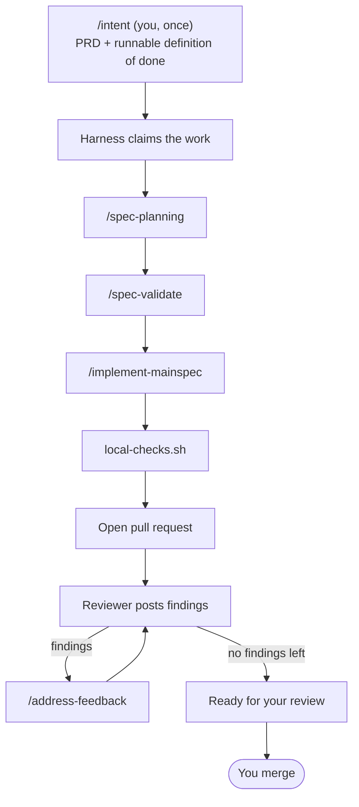

# The dispatcher: the deterministic engine

The dispatcher is the deterministic control flow at the center of the harness. It
is the piece that makes a run repeatable, crash-safe, and trustworthy to leave
unattended — because it holds **no LLM in the decision path** and **no hidden
state**.

## Artifacts are the state

The reason it is safe to leave the harness running is almost boring, and that is
the point. **The harness keeps no hidden state.** There is no daemon holding "I am
currently on step 3" in memory, no queue, no coordination service. The complete
state of every feature is observable from two things: the files on disk and the
branches in git.

A small bash script — the dispatcher
([`scripts/poll-and-dispatch.sh`](../../scripts/poll-and-dispatch.sh)) — wakes up
periodically, takes an environment as its argument, reads that environment's state
fresh, and decides the single next step for each active feature. Its core is an
`if/elif` chain: *planning output absent? run planning. Present but validation
absent? run validate.* The chain **is** the state machine; the artifacts on disk
**are** the state.

A feature advances as a sequence of states, each produced by one skill and
detected by the presence of its output on disk:

## Three properties that make it trustworthy

Three consequences fall out of "artifacts are the state," and together they are
why the machine is safe to run:

- **Crash recovery is free.** Kill the dispatcher mid-step — `kill -9`, a dead
  laptop, a closed lid. The next tick re-reads disk, sees the half-finished state,
  and resumes. Nothing to clean up, because nothing was ever held in memory to
  lose.
- **Every step runs in a fresh context window.** The dispatcher does not *do* the
  work; it shells out to a brand-new `claude -p` process per skill. Each skill
  reads what it needs from disk, does its job, writes its output, and exits. No
  step inherits another's polluted window — the
  [context-engineering](./context-engineering.md) problem, solved by construction.
  This is also why the loop can run for hours without the context rot a single
  long session accumulates.
- **The dispatcher itself contains no LLM.** The decision of *what runs next* is
  pure, deterministic bash. The intelligence is in the skills; the routing is
  mechanical. That is what makes "what will it do next?" answerable just by looking
  at disk — no model in the loop to second-guess.

## It never touches your checkout

The property developers ask about first: **the harness never touches your working
tree.** It operates on your clone only through git *refs* — fetching, pushing,
claiming branches — and does all its work in *sibling worktrees*
(`<env>-harness-<feature>`) it creates and tears down itself. Your uncommitted
work is structurally out of its reach.

## Scheduling is one exit code

The dispatcher does not schedule itself; a supervisor (or cron, or a server
runner) invokes it, and the dispatcher reports what happened through its **exit
code**:

- **0 — idle.** No work advanced. Sleep the interval (default 5 minutes) and tick
  again.
- **10 — work advanced.** Re-invoke immediately, so a claimed PRD marches through
  planning → validate → implement at machine speed instead of one step per nap.
- **non-zero error** — back off exponentially.

A STUCK feature reports idle, so a stuck environment never hot-loops. This one
exit code is the entire scheduling protocol; see [Run the harness](../how-to/run-the-harness.md)
for the CLI that drives it.

## The branch namespace is the work queue

There is no separate database of "what work exists." The branches *are* the
registry, and claiming work is a single atomic git rename — no lock service, no
coordination daemon. The full namespace and on-disk state layout are documented in
[Reference: state and branches](../reference/state-and-branches.md).

## The rigorous version

This page gives you the intuition. For the precise properties the harness holds
under concurrency, crashes, and restarts — and the proof it is safe to leave
running — see the [design invariants](../reference/invariants.md).

## Related

- [Harness engineering](./harness-engineering.md) — the discipline this engine
  realizes.
- [The output contract](./output-contract.md) — the guaranteed output the
  dispatcher drives toward, and the verification that backs it.
